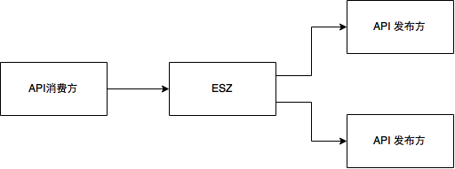

# esz

看到领导画的草图的那一刻，我就知道，这是一个ESB。和无数的其它场景一样，它是一个ESB可以解决,但又无法体现出ESB的全部能耐的场景。

放在以前，下一步就是选型->包装->深度制定->纠结的过程。现在活着的ESB产品已经不多了，选型似乎也不困难。WSO2很可能在选型中胜出，然后就是开始包装一个适合>国情的UI，然后纠结于解决各种被UI隐藏的不适合国情的问题...

但是，这次我不打算这么做了，这次，我决定：山寨一个ESB。

产生这个决定的原因还有一个，这次，我们不是卖ESB，我们不需要面对无穷无尽的未知的需求，我们有自己明确的需求域。我们只是一个项目，只是一个可能用到ESB的一
个项目。

我把这个项目起个小名叫做ESZ(大名叫啥我说了也不算)，之所以取名叫ESZ，因为山寨的精髓就是学而不像，自作主张的取其精华，去其糟粕。S和B连在一起，总是不太爽
的。替换为SZ又是啥意思呢？权且认为是"山寨"的缩写吧。

附：WS02的产品架构(好大的盘子!):

[[http://b.content.wso2.com/sites/all/themes/wso2-v6/images/wso2-platform-diagram.png]]

## 0. 从零开始

我们要做一个API网关，使用者可以通过我们提供的统一入口，来调用不同的API提供商提供的API。
解读一：
 1. 协议（REST）?
 2. 同步调用还是异步调用?
 3. 认证(OAUTH2)？授权？
 4. 服务等级协议（SLA）？
 5. 计费？
 6. 负载均衡和容错？
 7. API管理?版本?文档?热部署？发布和查找?监控?
 8. 二次开发？(协议适配？流程编排？）

对于每个问题，要么明确不考虑，要么就要考虑清楚。(要不我们重新谈谈包装wso2的问题？)

解读二(盈利点)：
 1. 缓存结果:程序的角度可以减少调用，节省资源。产品的角度就是减少重复付费，省钱。
 2. 二次分析:针对不同服务提供商提供的结果,或者结合我们自有数据，进行综合分析, 产生新的价值。

现在，ESZ大约应该是这样子的:
 

## 0.1 协议

协议分为两部分:
1. 消费协议: API消费方和ESZ之间的协议，消费协议大约可以确定位REST协议
2. 发布协议: API发布方和ESZ之间的协议, 发布协议我们说了就不算了，因为发布方发布的API不止给我们用，所以我们只能迁就。发布方要求使用什么协议，我们就使用什么协议。

注:比如，芝麻信用API使用基于HTTPS的类REST协议，或者说是HTTPS Web API。国政通的API是基于HTTP的WebService API

ESZ的协议支持描述如下:

## 0.2 同步调用还是异步调用

同步调用的优势是用户友好，调用方便。异步协议的优势是节省资源，劣势是实现较复杂。
同步转异步，改造难度大(异步的优势是节省资源，所以只能是改造为真异步，而不是简单封装为异步接口)。
异步转同步，只需要在接口层面上做一个简单的封装(同步的优势主要是接口友好，简单的封装即可)。
因此，ESZ的原则是尽量暴露给用户同步接口，同时在内部实现上以异步调用为主。

还是分两步说:
1. 消费调用：API消费方和ESZ之间的调用，消费调用大约是我们说了算，推荐采用异步方式,可以同时提供可选的封装成同步的接口,但不推荐使用。
2. 发布调用：API发部方和ESZ之间的效用，同样，我们说了不算，发布方要求使用什么协议，我们就使用什么协议。（当然，内部都会转为异步协议)

## 0.3 认证授权

计划采用开放平台公认的OAuth 2.0 授权认证标准。

注：芝麻信用API即采用了OAuth 2.0。

### TODO: 授权认证详细设计

## 0.4 服务等级协议

服务等级协议是ESZ与API消费方的协定,参考:http://wso2.com/cloud/managed/sla/

## 0.5 计费

离线计费: API调用时生成计费日志，根据计费日志离线计费。
在线计费: 基于Redis或Berkeley DB的实时计费。

参考：WSO2中，API Manager通过配合BAM实现计费。（BAM还做其它很多事儿)

# 核心技术

## 分布式共向内存

WSO2采用了Hazelcast

